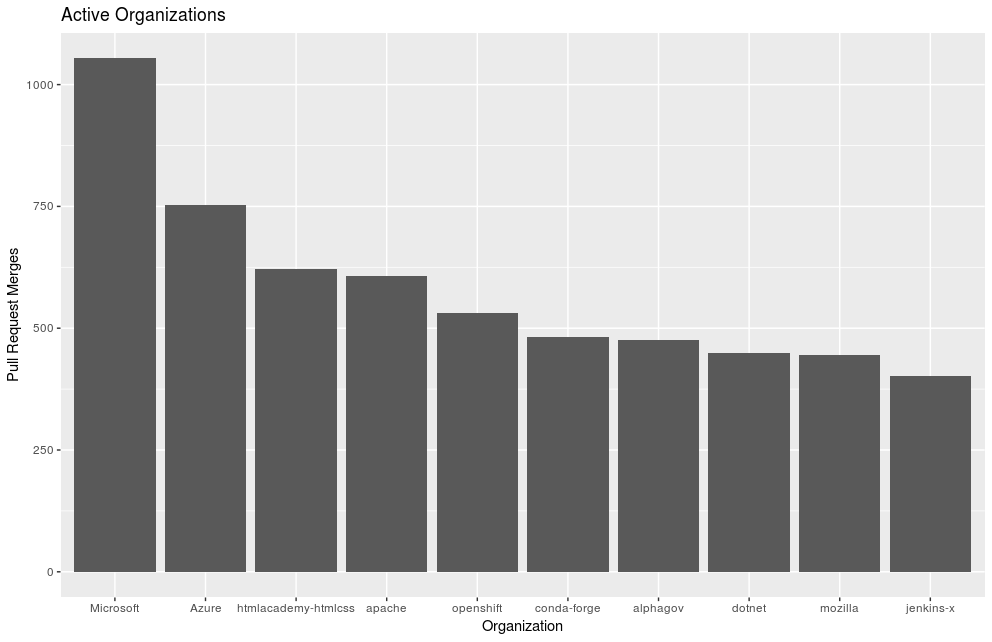
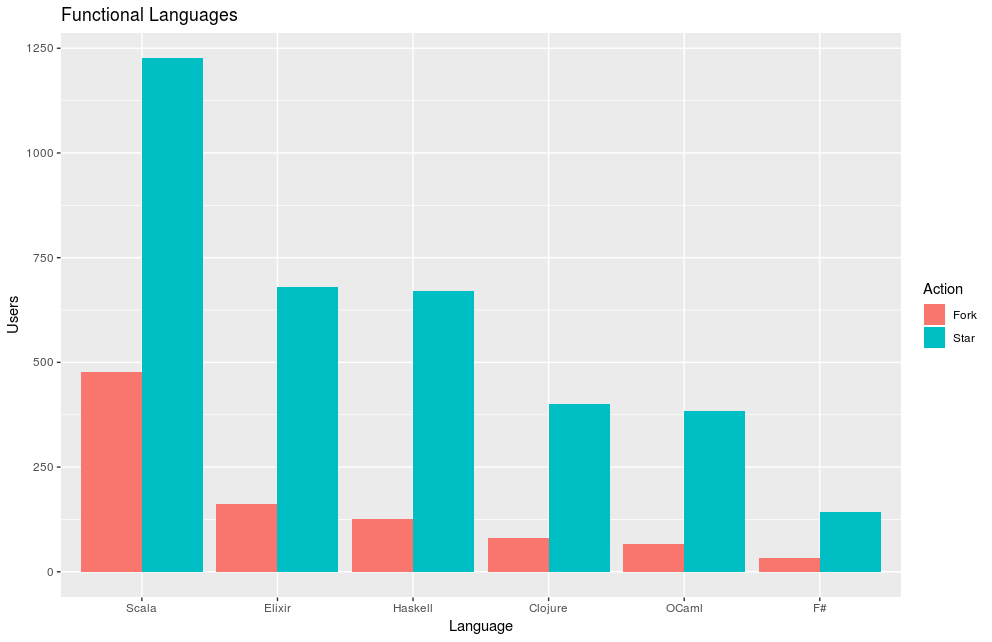
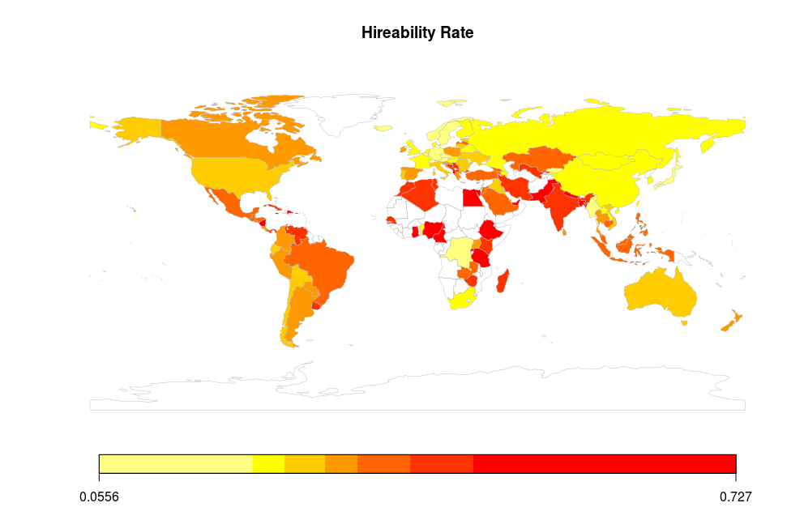

Get data from [Open Source Api](https://open-source-api.herokuapp.com/) and create visualizations with R

* [active-organizations.R](code/active-organizations.R)

* [functional-languages.R](code/functional-languages.R)

* [hireability-for-hire.R](code/hireability-for-hire.R)

