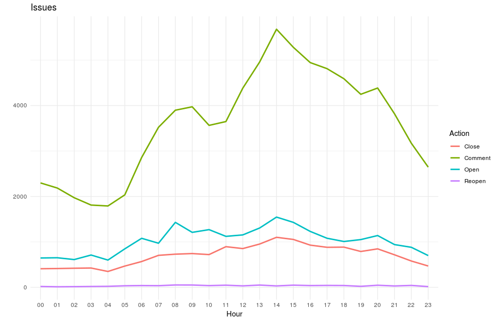

Get data from [DevSource](https://dev-source.herokuapp.com/) and create visualizations with R

* [active-organizations.R](code/active-organizations.R)

* [functional-languages.R](code/functional-languages.R)

* [hireability-rate.R](code/hireability-rate.R)

* [issues.R](code/issues.R)
    
